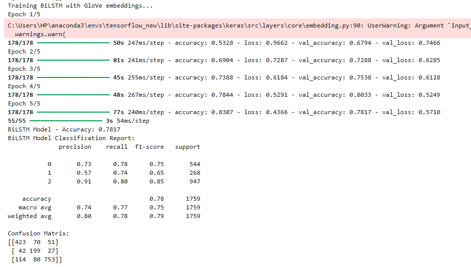

# Introduction

We've all been there — trying to transfer money in a hurry, only for the app to crash. Or waiting endlessly for a simple transaction to go through, dealing with poor customer support, or struggling with a confusing user interface. As a regular customer, it’s easy to feel ignored, disappointed, and even angry.
When that frustration builds up, what do most users think about?
- Closing the bank account altogether
- Switching to a more reliable bank
- Venting on social media or review platforms
These emotional reactions are more than just complaints — they’re valuable data.
For this project, I’m stepping into the role of a data analyst working with a digital banking provider. My goal is to analyze customer sentiment using real user feedback to uncover:
- What are customers complaining about most?
- Are there trends in negative feedback that could predict churn?
- Are there insights that could help improve the mobile banking experience?

By applying **Natural Language Processing (NLP)** techniques and sentiment analysis, this project aims to turn raw customer voices into **actionable business insights** that can help financial institutions improve **user experience**, **reduce churn**, and build stronger digital trust.

---
## 📊 Dataset

The dataset I’m using is sourced from Google play store and contains 8,798 rows and 14 columns. Each row represents user feedback on a mobile banking application, and each entry is tied to a specific banking app name — allowing for a comparison of user experiences across different financial institutions.

The columns in the dataset include a mix of textual data (like comments), ratings, developer reply and categorical variables such as the app name, review date, and version. These data points are ideal for sentiment analysis, topic modeling, and uncovering patterns in customer satisfaction or dissatisfaction.

For this project, I chose to use Python and key libraries like **NLTK**, **Tensorflow**, and **scikit-learn** for text preprocessing and analysis. Before diving into the modeling, I had to go through a rigorous data cleaning phase — handling missing values, dropping unecessary columns, coverting text to lower case, removing hashtags and normalizing the text for better sentiment interpretation.

This dataset gives me a solid foundation to explore what users are saying, how they feel about their banking experience, and where mobile apps might be falling short.

---
### Key Insights
1. Customer Sentiment Skews Negative
- The overall sentiment distribution reveals that:
  - Negative reviews dominate (4653)
  - Followed by positive (3444)
  - And a small portion are neutral (695)

This suggests widespread user dissatisfaction across banking apps, a critical signal for bad customer experience.

2. Frequent Issues Highlighted in Negative Reviews
- The negative sentiment word cloud highlights common frustrations:
- Words like **“can’t,”** **“update,”** **“login,”** **“error,”** **“time,”** **“problem,”** and **“frustrating”** appear frequently.
- Users are mainly struggling with:
  - App crashes or failed updates
  - Login and authentication issues
  - Delayed or failed transactions
  - Poor customer service and response times
  - Phrases like “still not working,” “can’t access,” and “help please” suggest a lack of technical reliability and user support.

3. Positive Feedback Centers Around Functionality and Convenience
- The positive sentiment word cloud shows terms like:
  - **“good,”** **“excellent,”** **“easy,”** **“convenient,”** **“secure,”** **“service,”** **“transaction,”** and **“efficient”**
- Positive reviewers appreciate:
  - Ease of use
  - Transaction reliability
  - Security and account management features
- Notably, users also express gratitude with words like “thank,” “love,” and “awesome,” indicating that when the app works well, it builds strong loyalty.
---
### 1. **Feature Extraction:**
- `FastText`
- `Word2Vec`
- `GloVe`

### 2. **Deep Learning Models:**
- Recurrent Neural Network (RNN)
- Long Short-Term Memory (LSTM)
- Bidirectional LSTM (Bi-LSTM)

### 3. **Sentiment Polarity Benchmarking:**
- VADER Sentiment Analysis (used to validate model outputs)
### What VADER Does:
- VADER uses a **predefined sentiment lexicon** where each word is rated for its emotional intensity.
- It applies **heuristic rules** to account for punctuation, capitalization, degree modifiers (e.g., "very", "extremely"), and conjunctions like "but" that shift polarity.
- It returns four sentiment scores:
  - **Positive**
  - **Negative**
  - **Neutral**
  - **Compound** — a normalized score between -1 (most negative) and +1 (most positive)

### Why VADER?
- VADER is **lightweight, fast**, and requires **no model training**.
- It’s ideal for benchmarking because of its **explainability and transparency**.
### ✅ Labeling Criteria
- Reviews with a **compound score ≥ 0.05** were labeled **Positive**
- Reviews with a **compound score ≤ -0.05** were labeled **Negative**
- Reviews with a **compound score between -0.05 and 0.05** were labeled **Neutral**

These labeled reviews were then used as inputs to train and test deep learning models.

### 🧪 Code Snippet

```python
from vaderSentiment.vaderSentiment import SentimentIntensityAnalyzer

analyzer = SentimentIntensityAnalyzer()

def get_sentiment_label(text):
    score = analyzer.polarity_scores(text)['compound']
    if score >= 0.05:
        return 'Positive'
    elif score <= -0.05:
        return 'Negative'
    else:
        return 'Neutral'

```python
from vaderSentiment.vaderSentiment import SentimentIntensityAnalyzer

analyzer = SentimentIntensityAnalyzer()
text = "This app is amazing and super user-friendly!"
score = analyzer.polarity_scores(text)
print(score)
# Output: {'neg': 0.0, 'neu': 0.254, 'pos': 0.746, 'compound': 0.8519} 
---

``` 

## ⚙️ Tools & Technologies

- Python (Jupyter Notebook, VS Code)
- TensorFlow / Keras
- NLTK, spaCy
- Gensim, GloVe, FastText
- Matplotlib / Seaborn for visualization
- Google Colab (for model training)
- Git & GitHub (version control)

---

## 📈 Results & Key Findings

- **Bi-LSTM** performed best with an accuracy of **78%** using **GloVe embeddings**.
- **FastText** offered better performance on low-frequency words.
- VADER scores correlated highly with Bi-LSTM predictions, validating model output consistency.
- User concerns centered around **app crashes**, **transaction failures**, and **user interface** issues.

---

## 📸 Visualizations

### ☁️ Word Cloud of Most Frequent Words
A WordCloud was generated to visualize the most common terms in the user reviews. This helps identify key themes and sentiments expressed by users.


---

### 📈 Sentiment Distribution
This plot shows the distribution of sentiments (Positive, Negative, Neutral) generated using VADER, which were used to label data for training the models.


---

### 🧠 BiLSTM Model Output
Below is a sample output from the **BiLSTM model**, which had the highest performance among the models evaluated. The model successfully predicts the sentiment label based on the review input.



---

### 🌐 Web Application Interface
The trained model was deployed using **Streamlit** with an interactive web interface. Banks can upload data and get sentiment classifications.


  


