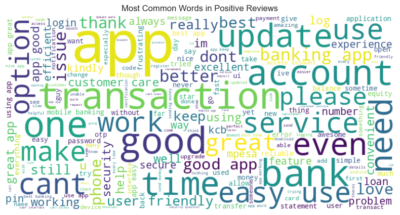

# Deep Learning Model for Sentiment Analysis Based on User Reviews  
### A Case Study on Mobile Banking Applications
# About

This project focuses on building deep learning models to classify user reviews from mobile banking applications into sentiment categories (positive, negative, neutral). The goal was to analyze the public perception and usability concerns of digital banking platforms by applying Natural Language Processing (NLP) and advanced deep learning techniques.
By leveraging word embeddings and sequential neural networks, the project demonstrates how user feedback can be transformed into actionable insights for product improvement and customer experience enhancement.

## 🎯 Objectives

- To preprocess and analyze mobile banking app user reviews.
- To analyse the drivers of sentiments by users of mobile banking applications.
- To build and compare deep learning models (RNN, LSTM, Bi-LSTM) for sentiment classification.
- To evaluate the effectiveness of different word embedding techniques (FastText, Word2Vec, GloVe).
- To validate polarity using VADER as a rule-based sentiment reference.

---
## 📊 Dataset

- **Source**: Publicly available mobile banking app reviews (Play Store)
- **Content**: User comments, ratings, timestamps, Developer reply
- **Preprocessing**: Cleaning, tokenization, stopword removal, padding, balancing imbalanced data
## 🧠 Methods & Models

### 1. **Feature Extraction:**
- `FastText`
- `Word2Vec`
- `GloVe`

### 2. **Deep Learning Models:**
- Recurrent Neural Network (RNN)
- Long Short-Term Memory (LSTM)
- Bidirectional LSTM (Bi-LSTM)

### 3. **Sentiment Polarity Benchmarking:**
- VADER Sentiment Analysis (used to validate model outputs)
### What VADER Does:
- VADER uses a **predefined sentiment lexicon** where each word is rated for its emotional intensity.
- It applies **heuristic rules** to account for punctuation, capitalization, degree modifiers (e.g., "very", "extremely"), and conjunctions like "but" that shift polarity.
- It returns four sentiment scores:
  - **Positive**
  - **Negative**
  - **Neutral**
  - **Compound** — a normalized score between -1 (most negative) and +1 (most positive)

### Why VADER?
- VADER is **lightweight, fast**, and requires **no model training**.
- It’s ideal for benchmarking because of its **explainability and transparency**.
### ✅ Labeling Criteria
- Reviews with a **compound score ≥ 0.05** were labeled **Positive**
- Reviews with a **compound score ≤ -0.05** were labeled **Negative**
- Reviews with a **compound score between -0.05 and 0.05** were labeled **Neutral**

These labeled reviews were then used as inputs to train and test deep learning models.

### 🧪 Code Snippet

```python
from vaderSentiment.vaderSentiment import SentimentIntensityAnalyzer

analyzer = SentimentIntensityAnalyzer()

def get_sentiment_label(text):
    score = analyzer.polarity_scores(text)['compound']
    if score >= 0.05:
        return 'Positive'
    elif score <= -0.05:
        return 'Negative'
    else:
        return 'Neutral'

```python
from vaderSentiment.vaderSentiment import SentimentIntensityAnalyzer

analyzer = SentimentIntensityAnalyzer()
text = "This app is amazing and super user-friendly!"
score = analyzer.polarity_scores(text)
print(score)
# Output: {'neg': 0.0, 'neu': 0.254, 'pos': 0.746, 'compound': 0.8519} 
---

``` 

## ⚙️ Tools & Technologies

- Python (Jupyter Notebook, VS Code)
- TensorFlow / Keras
- NLTK, spaCy
- Gensim, GloVe, FastText
- Matplotlib / Seaborn for visualization
- Google Colab (for model training)
- Git & GitHub (version control)

---

## 📈 Results & Key Findings

- **Bi-LSTM** performed best with an accuracy of **78%** using **GloVe embeddings**.
- **FastText** offered better performance on low-frequency words.
- VADER scores correlated highly with Bi-LSTM predictions, validating model output consistency.
- User concerns centered around **app crashes**, **transaction failures**, and **user interface** issues.

---

## 📸 Visualizations

### ☁️ Word Cloud of Most Frequent Words
A WordCloud was generated to visualize the most common terms in the user reviews. This helps identify key themes and sentiments expressed by users.



---

### 📈 Sentiment Distribution
This plot shows the distribution of sentiments (Positive, Negative, Neutral) generated using VADER, which were used to label data for training the models.


---

### 🧠 BiLSTM Model Output
Below is a sample output from the **BiLSTM model**, which had the highest performance among the models evaluated. The model successfully predicts the sentiment label based on the review input.


---

### 🌐 Web Application Interface
The trained model was deployed using **Flask** with an interactive web interface. Users can input a review and get real-time sentiment prediction.


  
